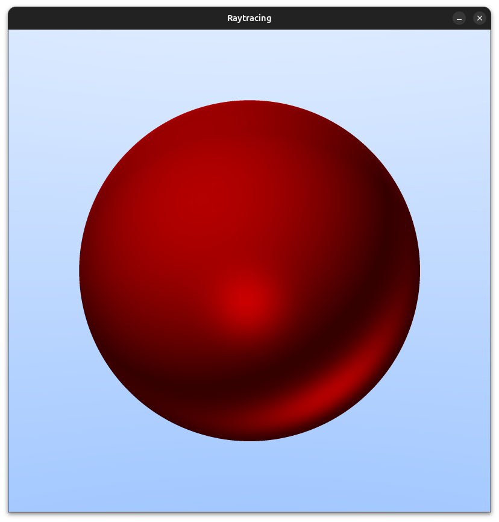

# Simple Raytracing algorithm

This is a simple raytracing implementation made just to understand how 
graphics rendering works. It still yet to be finished, however the 
overall program is kinda usable

## resources

Mainly two:
- [raytracing in one weekend](https://raytracing.github.io/books/RayTracingInOneWeekend.html)
- [computer graphics from scratch](https://www.gabrielgambetta.com/computer-graphics-from-scratch/)

## how to compile

You need to install SDL2 as a dependency, then exec
the command 'make' in order to get the final executable
